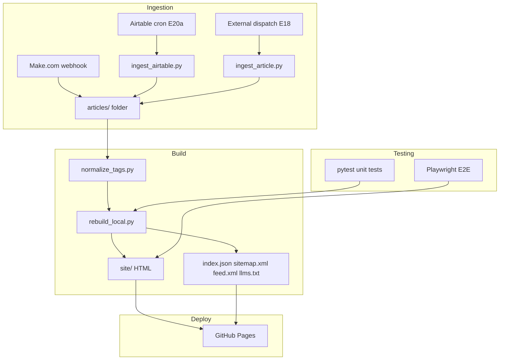

# Architecture

This document describes the system architecture of the First AI Movers article archive.

## Overview

The archive is a static-site generator built in Python. Articles are stored as Markdown + JSON metadata in `articles/YYYY-MM-DD-slug/`. A build pipeline normalizes tags, rebuilds derived artifacts (index, sitemap, feeds, LLM corpus), renders HTML via Jinja2, and deploys to GitHub Pages.

## Dataflow



## Ingestion Flows

### Flow A — Make.com (legacy, still active)
Make.com receives a Beehiiv webhook, pushes article Markdown + metadata to this repository via GitHub API. Commits land on `main` and trigger `build-and-deploy.yml`.

### Flow B — External `repository_dispatch` (E18)
External systems POST to `repos/{owner}/{repo}/dispatches` with `event_type: new-article`. `.github/workflows/ingest-article.yml` validates the payload, runs `ingest_article.py`, normalizes tags, rebuilds, runs tests, and opens a PR. Never pushes directly to `main`.

### Flow C — Airtable cron (E20a, dry-run validated)
`.github/workflows/ingest-airtable.yml` runs daily at 06:17 UTC. `ingest_airtable.py` fetches records modified in the last 72 h, validates against `article_schema.json`, and opens a PR. Write mode is disabled pending a controlled single-record write test.

## Build Pipeline

### Tag normalization (`normalize_tags.py`)
Maps raw article `tags` to canonical `topics` using `tools/topic_mapping.json`. Also cleans string fields (title, slug, canonical_url, folder). Runs before every rebuild.

### Rebuild (`rebuild_local.py`)
The main orchestrator:
1. Scans `articles/*/metadata.json` to build `index.json`
2. Patches `README.md` and `llms.txt` with current stats
3. Generates `sitemap.xml`, `feed.xml`, `feed.json`
4. Generates `llms-full.txt` and `llms-recent.txt` (LLM corpus)
5. Renders the entire static site into `site/` using Jinja2 templates
6. Copies raw data mirrors into `site/` (index.json, feed.xml, etc.)

### Site generation
Jinja2 templates in `templates/`:
- `home.html.j2` — homepage with latest articles
- `topic.html.j2` — per-topic hub pages (≥5 articles)
- `topics_index.html.j2` — topics directory
- `article.html.j2` — per-article page with TOC, reading time, related articles
- `about.html.j2` — about page
- `base.html.j2` — shared layout (dark mode, nav, search)

Static assets in `static/` are copied verbatim.

## CI/CD Workflows

| Workflow | Trigger | Purpose |
|---|---|---|
| `tests.yml` | PR, push to `main` | Python unit + integration tests |
| `e2e.yml` | PR, push to `main`, nightly | Playwright browser tests |
| `build-and-deploy.yml` | Push to `main` touching content/tools/templates | Normalize, rebuild, commit artifacts, deploy to Pages |
| `gitleaks.yml` | PR, push to `main` | Secret scanning |
| `ingest-airtable.yml` | Schedule (daily), `workflow_dispatch` | Airtable cron ingestion (dry-run) |
| `ingest-article.yml` | `repository_dispatch`, `workflow_dispatch` | External article ingestion |

## Testing Layers

### Unit / integration tests (`tools/tests/`)
303 tests covering ingestion, validation, tag normalization, sitemap generation, feed generation, LLM corpus, search, SEO metadata, governance, and E2E contract tests. 13 optional `TestAddTldr` tests require `openai` and `python-dotenv`.

### E2E tests (`tests-e2e/`)
32 Playwright browser tests running against the built `site/` served by a local static server. Covers home, topics, article pages, search, feeds/sitemap, and accessibility semantics.

## Directory Structure

```
articles/
  YYYY-MM-DD-slug/
    article.md          # Full article text
    metadata.json       # Structured metadata
tools/
  rebuild_local.py      # Main build orchestrator
  normalize_tags.py     # Tag → topic normalization
  ingest_airtable.py    # Airtable ingestion (E20a)
  ingest_article.py     # External payload ingestion (E18)
  check_duplicate_titles.py
  submit_indexnow.py    # SEO ping
  scrub_presigned_urls.py
  tests/                # Pytest suite
templates/
  *.html.j2             # Jinja2 templates
static/
  style.css             # Custom CSS
  search.js             # Client-side search
  sitemap.xsl           # Styled sitemap
docs/
  ARCHITECTURE.md       # This file
  OPERATIONS.md         # Runbooks
  CHANGELOG.md          # Release history
  EXTERNAL_PUBLISHING.md
  BRANCH_PROTECTION.md
  airtable-ingestion.md
  search-visibility-monitoring.md
site/                   # Generated static site (gitignored)
```

## Key Design Decisions

- **Static site, not SSR:** Every page is pre-rendered HTML. No runtime server needed.
- **Markdown + JSON, not a database:** Articles are plain files. Git is the version history.
- **Jinja2, not a JS framework:** Simple, fast, no build-time JS dependencies.
- **Dual license:** Article content is CC BY 4.0; code/tooling is Apache-2.0.
- **Never push directly to `main` from automation:** All ingestion flows open PRs for human review.
