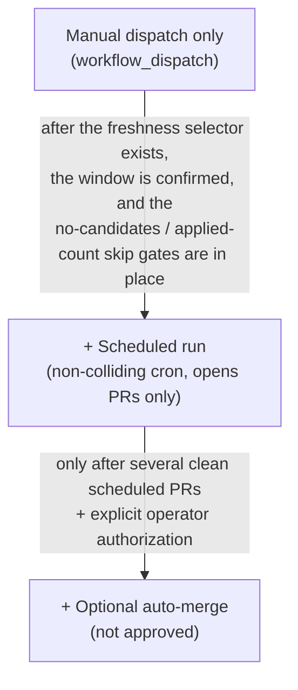

# Summary CI Automation Plan

This document describes the planned automation for generating article summaries in CI. It is a
forward-looking plan and its guardrails — **not** a description of a live system. No live or
scheduled summary generation runs today; the only automation that exists is a manual, no-network
presence smoke (see [Current state](#current-state)).

For how summaries themselves work (the three lengths, the review workflow, the deterministic gate,
and the dual-verifier requirement), see [`SUMMARIES.md`](./SUMMARIES.md).

---

## Purpose

Provide a **fresh-article-only** summary-generation path that, on demand, produces the short /
medium / long summaries for **recently published** articles that are still missing them, runs them
through the dual-verifier review, and **proposes** the approved summaries via a pull request for
human review. The goal is to keep new articles summarized without a human running the pipeline by
hand — while never reprocessing the older missing-summary backlog and never publishing a summary
that a human has not had the chance to review.

## Current state

| Piece | Status |
|---|---|
| Manual presence smoke (`.github/workflows/summary-automation-smoke.yml`) + `tools/check_provider_keys_present.py` | **Proposed in a pull request — not yet merged.** A `workflow_dispatch`-only, no-network smoke that checks provider-key presence and exercises the runner's dry-run command shape. It makes no provider calls, writes nothing, and is not a required check. |
| Fresh-candidate selector | **Not built.** This is the precondition for everything below. |
| Summary apply workflow (generate → verify → apply → open PR) | **Not built.** Planned; gated on the selector. |
| Scheduled / unattended runs | **Not built and not approved.** |

> The summary tooling already supports a missing-summary selection (`tools/run_summary_batch.py
> --missing-only`), but today that returns the **entire** missing-summary backlog — the bulk of
> which is older articles. Until a freshness selector constrains generation to recently published
> articles, **no live or scheduled run is safe**, because any run would target the old backlog.

## Non-goals

- **No old-backlog sweep.** The automation never reprocesses the older missing-summary backlog.
- **No direct pushes to `main`.** Every change is proposed as a branch + pull request.
- **No auto-merge.** The summaries PR is always left for human review.
- **No live or scheduled generation before the freshness selector exists** and the operator
  enables it.
- **No weakening of the dual-verifier acceptance gate** (see [Safety boundaries](#safety-boundaries)).

---

## Freshness selector (the prerequisite)

The automation must select **only fresh missing-summary candidates**. The selector reads the
existing `published_date` field (present in both `index.json` and each article's `metadata.json`)
and applies a recency window:

- **Lookback window** — a relative window (e.g. "published within the last *N* days"). The exact
  *N* is an operator decision; a conservative initial window is intended.
- **Hard floor** — an absolute earliest-date floor so the window can **never** reach back into the
  older backlog, even if the relative window is misconfigured.
- **Missing / invalid dates fail closed** — an article whose `published_date` is missing or
  unparseable is **excluded** by default (treated as not-fresh), never silently included.
- **Interaction with missing-only** — the freshness filter composes with the existing
  missing-summary filter and the batch limit: a candidate must be both *missing a summary* **and**
  *within the fresh window*; the batch limit then caps how many are processed per run.
- **Deterministic ordering** — selection preserves the existing newest-first ordering and is
  deterministic, so the same inputs always yield the same candidate set.
- **Old-residue exclusion is the load-bearing property.** The selector exists specifically so that
  a run can never select the older backlog. A run with no fresh candidates is a valid no-op.

Until this selector exists and the operator confirms the window, the automation is **blocked** from
any live or scheduled run.

---

## Safety boundaries

These are non-negotiable and hold for every part of the automation.

- **Branch + pull request only — never a direct push to `main`; no auto-merge initially.** The
  summaries PR is a dedicated PR left for human review.
- **Dual-verifier acceptance is the only gate that writes a summary into article metadata.** A
  summary is applied only when **both** verifiers return the automatic-approval verdict — never on a
  single verifier and never with a relaxed acceptance band. This is the production trust contract
  and is preserved verbatim.
- **Presence-only secret handling in CI.** Provider keys are checked for **presence** (`present` /
  `absent`) only. No secret value, key material, or secret-manager identifier ever appears in logs
  or PR text. Provider keys are referred to by **name** only: `MINIMAX_API_KEY`, `OPENAI_API_KEY`,
  `ANTHROPIC_API_KEY`, and the optional fallback `DEEPSEEK_API_KEY`.
- **In-job artifact rebuild.** Applying a summary mutates an article's `metadata.json`, which
  propagates into committed generated artifacts (the article index, feeds, the `llms-*` files,
  JSON-LD and Open Graph metadata). The apply workflow therefore regenerates and commits the full
  set of generated artifacts **in the same job** (via `tools/rebuild_local.py`,
  `tools/update_docs.py`, and `tools/export_mcp_data.py`) so the generated-artifacts drift check
  (`tools/check_generated_artifacts.py`) stays green. Generated artifacts are never hand-edited.
- **No empty or duplicate PRs.** A PR is opened only when at least one summary was applied; a static
  concurrency group and a stable PR branch ensure a re-run updates the existing PR instead of
  opening a duplicate.
- **Article bodies are never modified.** Only summary fields in `metadata.json` and the regenerated
  generated artifacts are written.

---

## Secret / key policy

- **Smoke (today): no keys in CI.** The presence smoke declares no secrets; with no keys injected it
  reports `absent` and fails closed — the intended behavior of a presence gate.
- **Live (future): decision pending.** A live run needs the provider keys available to CI. The
  choice between injecting them as direct CI secrets and fetching them at runtime from a secret
  manager (e.g. via a `doppler run -- <command>`-style wrapper) is an open operator decision. The
  tooling reads keys from the environment, so either mechanism works without code changes.
- **No secret-manager project, config, or organization identifiers** appear in any committed file,
  log, or PR. Any such reference in documentation uses a generic placeholder.

## Budget policy

- **Per-run cap.** A live run always passes a deliberate per-run cost ceiling; the runner stops
  before processing further articles once the ceiling is reached.
- **Aggregate ceiling.** A monthly / cumulative ceiling is owned procedurally by a named operator
  who reads per-run spend from the run report. (No automated cumulative cap exists today.)
- **Fail closed.** A run is bounded by both the per-run cost ceiling and the batch limit; if the
  budget would be exceeded, the run stops rather than continuing.

---

## Trigger ladder

The automation escalates conservatively. Each rung has a hard precondition.

- **Manual dispatch first.** The only safe trigger before the freshness selector exists. A human
  initiates each run.
- **Scheduled runs later.** A non-colliding schedule may be added **only after** the freshness
  selector exists and the no-candidates / open-PR / applied-count skip gates are in place. A
  scheduled run may **open** PRs but never merges them; it skips when there are no fresh candidates
  or when a summaries PR is already open; and it must avoid colliding with the existing ingestion
  schedule.
- **Ingestion-chained runs deferred.** Triggering off the upstream ingestion workflow is deferred
  until that workflow's completion semantics are confirmed stable.
- **Auto-merge is not approved.** It would only be considered after a sustained record of clean
  scheduled PRs and an explicit operator decision.

---

## Future implementation (ordered)

Each step is shipped and reviewed independently; later steps depend on earlier ones.

1. **Freshness selector + tests** — the recency window, the hard floor, the fail-closed-on-bad-date
   rule, and tests proving the older backlog is excluded. *(Prerequisite for everything below.)*
2. **Candidate / dry-run report** — a no-network mode that lists which fresh candidates would be
   processed, writing nothing, so the selection can be reviewed before any live run.
3. **Generated-artifact rebuild verification** — confirm the in-job rebuild keeps the
   generated-artifacts drift check green.
4. **Apply path** — apply only dual-verifier-approved summaries into `metadata.json`.
5. **PR-creation workflow** — manual dispatch; open a branch + PR with the applied summaries and the
   regenerated artifacts; skip when nothing was applied; scan the PR text for public-surface safety.
6. **Scheduled trigger** — add later, with the skip gates above, once the selector is in place.

## Validation requirements

Any change in this area must:

- keep the generated-artifacts drift check (`tools/check_generated_artifacts.py`) green;
- pass the repository test suite, including workflow-shape tests for any new or changed workflow;
- pass a public-surface scan of all changed files and any PR text — no secret values, no
  secret-manager identifiers, no environment dumps, no raw provider logs, and no local absolute
  paths; only repo-relative paths and provider key **names** may appear;
- be proposed as a pull request and left for human review (never a direct push to `main`, never
  auto-merged).

## Hard halts

Stop and escalate if any of the following would occur:

- a live or scheduled run before the freshness selector exists and is enabled;
- a run that could select the older missing-summary backlog;
- a summary written to metadata on anything other than the dual-verifier automatic-approval verdict;
- a direct push to `main`, or auto-merge of a summaries PR;
- a secret value, secret-manager identifier, environment dump, or raw provider log in any log or PR.

---

*This document describes planned automation and its guardrails. It enables no live run, ships no
selector code, and changes no workflow or tool.*
